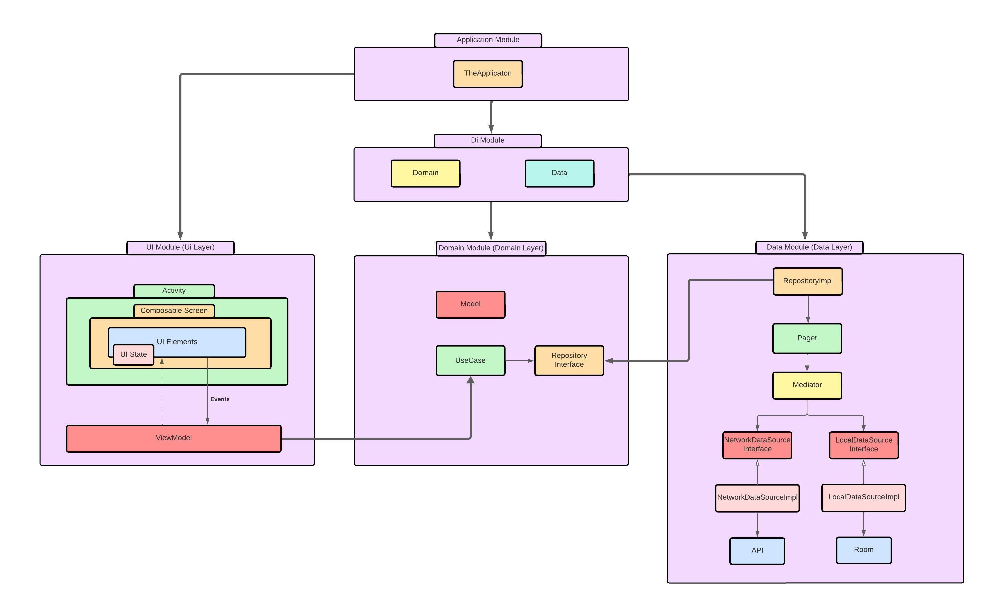

# :rocket:RickAndMortyApp:rocket:

This is an example of how to build an application with good practices, using SOLID principles and clean architecture.  If you disagree with anything, please let me know, and if you have any doubts or improvements, please feel free to contact me.

### APP
Let's talk about the app. This app is based on one of the best adult animated science fiction TV series, Rick and Morty.

I have used a [The Rick and Morty API](https://rickandmortyapi.com/), that's an amazing FREE API.

Display a list of all Rick and Morty characters, a detailed view of each character with additional information.

### MAIN TECHNOLOGIES
* Programming language - [Kotlin](https://kotlinlang.org/)
* Architecture - MVVM with [Android Architecture Components](https://developer.android.com/topic/libraries/architecture/)
* Android Jetpack Compose - [Jetpack Compose](https://developer.android.com/compose)
* RemoteMediator (Paging with Room) - [RemoteMediator](https://developer.android.com/topic/libraries/architecture/paging/v3-network-db)
* Coroutines/Flows - [Coroutines/Flow](https://kotlinlang.org/docs/reference/coroutines-overview.html)
* Dependency injection - [Koin](https://insert-koin.io/)
* Images loading and caching - [Coil](https://github.com/coil-kt/coil)
* HTTP client - [Retrofit](https://square.github.io/retrofit/)
* ...error handling, caching, offline support, and light/dark theme support

### TECHNOLOGIES USED FOR TESTING
* jUnit - [jUnit](https://junit.org/junit5/)
* Mockk - [Mockk](https://mockk.io/)
* MockWebServer - [MockWebServer](https://github.com/square/okhttp/tree/master/mockwebserver)
* KotlinCoroutinesTest - [KotlinCoroutinesTest](https://kotlin.github.io/kotlinx.coroutines/kotlinx-coroutines-test/)
* ... using the Arrange-Act-Assert pattern, also known as the AAA.

### ARCHITECTURE
I have used an architecture based on different modules using clean architecture:

* Application
* Di
* Ui
* Domain
* Data

### Enjoy :smile: